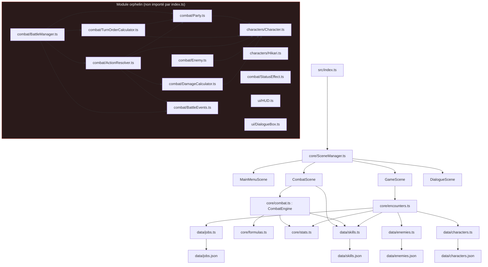
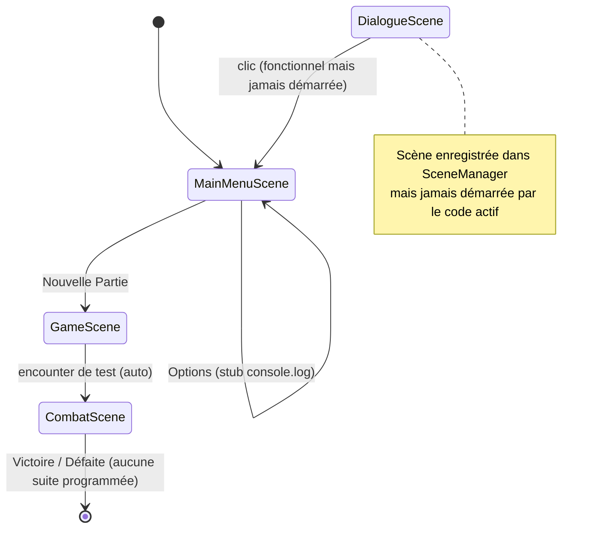
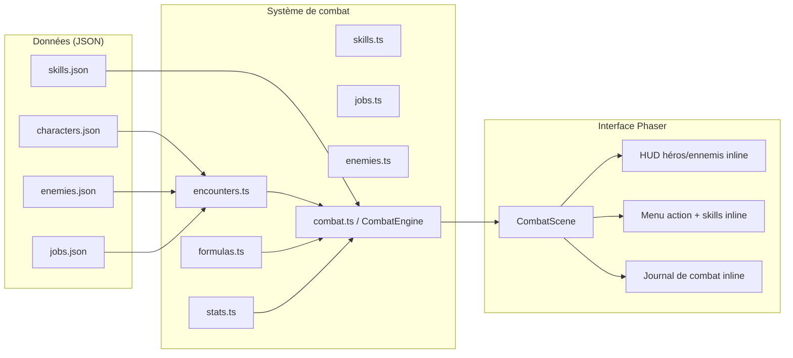

# Architecture — Octorogue Traveler

## Vue d'ensemble des dossiers

```
octoroguetraveler/
├── assets/
│   ├── backgrounds/background2.jpg
│   └── music/Main-Theme.mp3
├── docs/
│   └── gameplay.md
├── src/
│   ├── index.ts
│   ├── core/            (moteur actif : combat, stats, données)
│   ├── scenes/           (4 scènes Phaser)
│   ├── data/              (JSON de contenu + wrappers TypeScript)
│   ├── characters/     (module orphelin, non importé)
│   ├── combat/            (module orphelin, non importé, hors scènes)
│   └── ui/                    (module orphelin, non importé)
├── index.html
├── package.json
├── tsconfig.json
├── webpack.config.js
└── config.yaml            (workflow CI mal placé)
```

### `assets/`
Contient les seules deux ressources binaires du dépôt : `backgrounds/background2.jpg` (fond utilisé par le menu principal et la scène de combat) et `music/Main-Theme.mp3` (musique utilisée au menu et en combat). Aucun sous-dossier pour les sprites de personnages/ennemis n'existe, alors que `src/characters/Hikari.ts` référence une feuille de sprite `"hikari"` jamais chargée nulle part.

### `docs/`
Contient `gameplay.md`, une documentation technique correcte et à jour décrivant les règles du moteur de combat actif (HP/SP/BP/IP, Break, formules, flux de tour). C'est la documentation la plus fiable du dépôt — plus fiable que le `README.md` racine.

### `src/core/`
Contient le moteur de jeu actif, indépendant de Phaser sauf pour les types de données :
- `stats.ts` : types `Stats`, `Resources`, `BattleStats`, `DamageType`, valeurs par défaut, fabrique `createBattleStats`.
- `skills.ts` : type `Skill`, `SkillCategory`, `SkillTarget`, `SkillDictionary`.
- `jobs.ts` : type `Job`, `JobDictionary`.
- `enemies.ts` : type `EnemyTemplate`, `EnemyDictionary`.
- `formulas.ts` : fonctions pures de calcul (`calculateDamage`, `applyBreak`, `tickResources`, `spendResources`, `gainIP`).
- `combat.ts` : classe `CombatEngine`, orchestrateur du tour par tour (état, actions, IA ennemie simple, victoire/défaite, journal).
- `encounters.ts` : fabrique des combattants à partir des templates de données (`createHeroFromTemplate`, `createEnemyFromTemplate`, `createTestEncounter`).

### `src/scenes/`
Les 4 scènes Phaser du jeu, enregistrées dans `src/core/SceneManager.ts` :
- `MainMenuScene.ts` : menu principal jouable (titre, 3 options, navigation clavier, musique en boucle).
- `GameScene.ts` : placeholder — crée une rencontre de test et bascule immédiatement vers `CombatScene`, sans aucune logique de monde/exploration.
- `CombatScene.ts` : scène la plus développée du dépôt (324 lignes) — affiche HUD héros/ennemis, menu d'action, sous-menu de compétences, journal de combat, gère les entrées clavier et souris, pilote `CombatEngine`.
- `DialogueScene.ts` : scène fonctionnelle isolément (affiche un texte, retourne au menu au clic) mais **jamais atteinte** depuis le flux de jeu réel (aucun appel `scene.start("DialogueScene")` ailleurs dans le code).

### `src/data/`
Données de contenu au format JSON, chacune enveloppée par un fichier `.ts` qui la type et la transforme en dictionnaire indexé par `id` :
- `characters.json` / `characters.ts` : 2 héros (Olberic, Cyrus).
- `enemies.json` / `enemies.ts` : 1 ennemi (Rat des bois).
- `jobs.json` / `jobs.ts` : 2 jobs (Champion, Érudit).
- `skills.json` / `skills.ts` : 2 compétences (Attaque, Boules de Feu).

### `src/characters/`, `src/combat/*` (hors scènes), `src/ui/`
Module **orphelin** : aucun fichier n'est importé, directement ou indirectement, par `src/index.ts`. Il s'agit d'un second système de combat (classes `Character`, `Enemy`, `Party`, `BattleManager`, `TurnOrderCalculator`, `ActionResolver`, `DamageCalculator`, `BattleEvents`, `StatusEffect`) et de composants UI (`HUD`, `DialogueBox`) qui ne sont utilisés par rien. `Hikari.ts` (sprite animé) fait aussi partie de cet ensemble non connecté. Ce module n'est pas exécuté au runtime mais reste compilé par TypeScript (`tsconfig.json` inclut tout `src/**/*.ts`) et alourdit la base de code.

## Responsabilités des scènes

| Scène | Rôle | État |
|---|---|---|
| `MainMenuScene` | Point d'entrée visuel, sélection Nouvelle Partie / Continuer / Options | Fonctionnelle pour "Nouvelle Partie" uniquement |
| `GameScene` | Censée porter la boucle hors-combat (exploration, carte) | Placeholder : redirige immédiatement vers le combat |
| `CombatScene` | UI + contrôleur du combat, pont entre input joueur et `CombatEngine` | La plus aboutie du dépôt |
| `DialogueScene` | Affichage de dialogues | Fonctionnelle mais orpheline (jamais démarrée) |

## Responsabilités des principales classes

| Classe | Fichier | Rôle |
|---|---|---|
| `CombatEngine` | `core/combat.ts` | Source de vérité de l'état de combat : tours, résolution d'actions, IA ennemie basique, détection de victoire/défaite, journal |
| `CombatScene` | `scenes/CombatScene.ts` | Rendu Phaser du combat + gestion des entrées ; délègue toute la logique à `CombatEngine` |
| `MainMenuScene` | `scenes/MainMenuScene.ts` | Rendu + navigation du menu principal |
| — *(orphelines, non exécutées)* | | |
| `Character` | `characters/Character.ts` | Modèle de personnage alternatif (HP/SP/ATK/DEF...) avec méthodes `attack`, `heal`, `takeDamage` |
| `BattleManager` | `combat/BattleManager.ts` | Orchestrateur de combat alternatif, boucle `nextTurn` récursive |
| `DamageCalculator` | `combat/DamageCalculator.ts` | Calcul de dégâts alternatif, très proche de `core/formulas.ts` mais dupliqué avec une API différente |

## Dépendances importantes

- **Phaser 3** (`^3.87.0`) : moteur de rendu et de scènes, seule dépendance de production.
- **TypeScript** (`^5.7.3`) + **ts-loader** : compilation, mode `strict`.
- **Webpack 5** (`webpack`, `webpack-cli`, `webpack-dev-server`, `html-webpack-plugin`, `copy-webpack-plugin`) : bundling, serveur de dev sur le port 8080, copie du dossier `assets/` vers `dist/assets`.
- Couplage interne fort entre `scenes/CombatScene.ts` et `core/combat.ts` (la scène connaît directement la forme de `CombatStateSnapshot`), ce qui est acceptable à cette échelle mais limiterait la réutilisation du moteur avec une autre UI.
- Couplage interne entre `core/encounters.ts` et l'ensemble de `data/` (imports directs de `characters`, `enemies`, `jobs`, `skills`) : `encounters.ts` agit comme point d'assemblage entre données brutes et objets de combat.

## Flux général du jeu (état actuel)

1. `src/index.ts` crée l'instance `Phaser.Game` avec la config (800×600, canvas `game-container`) et charge la liste de scènes exportée par `SceneManager`.
2. `MainMenuScene` démarre en premier (ordre du tableau `scenes`). Le joueur peut naviguer et valider "Nouvelle Partie".
3. `GameScene` démarre, crée immédiatement une rencontre de test (`createTestEncounter`) et bascule vers `CombatScene` en lui passant les données de rencontre.
4. `CombatScene` instancie un `CombatEngine` avec les héros/ennemis de la rencontre, affiche le HUD, et boucle sur `advanceTurn()` : tours ennemis résolus automatiquement (IA simple), tours héros en attente d'une action joueur (Attaque / Skills / Défendre).
5. À victoire ou défaite, un message est affiché mais **aucune transition n'est programmée ensuite** (pas de retour au menu, pas d'écran de résultats, pas de sauvegarde) : le joueur reste bloqué sur cet écran.
6. `DialogueScene` existe mais n'est jamais atteinte par ce flux.

## Diagrammes Mermaid

### Dépendances principales entre modules



### Architecture des scènes (navigation)



### Architecture des systèmes (module actif uniquement)


