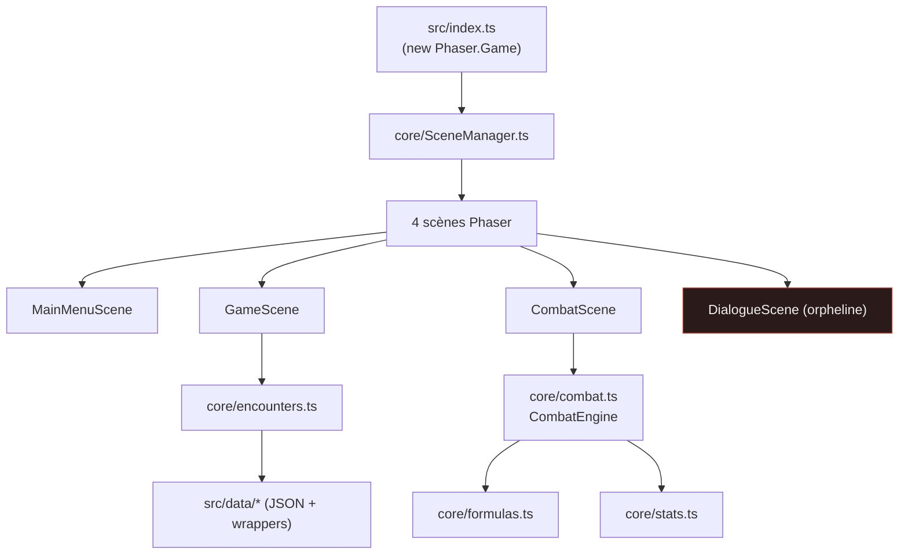
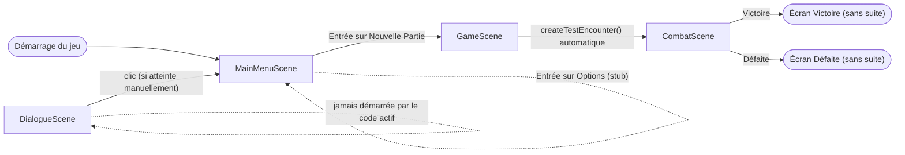
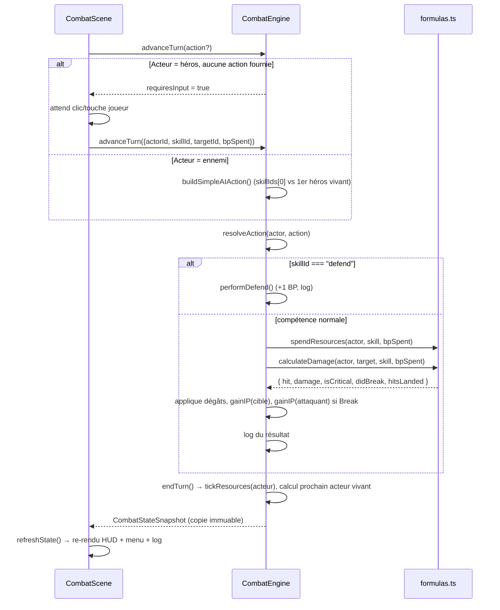
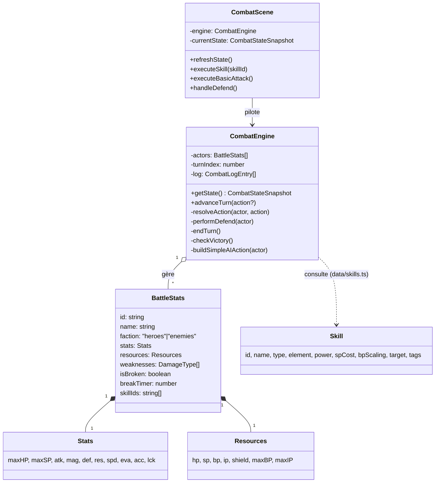
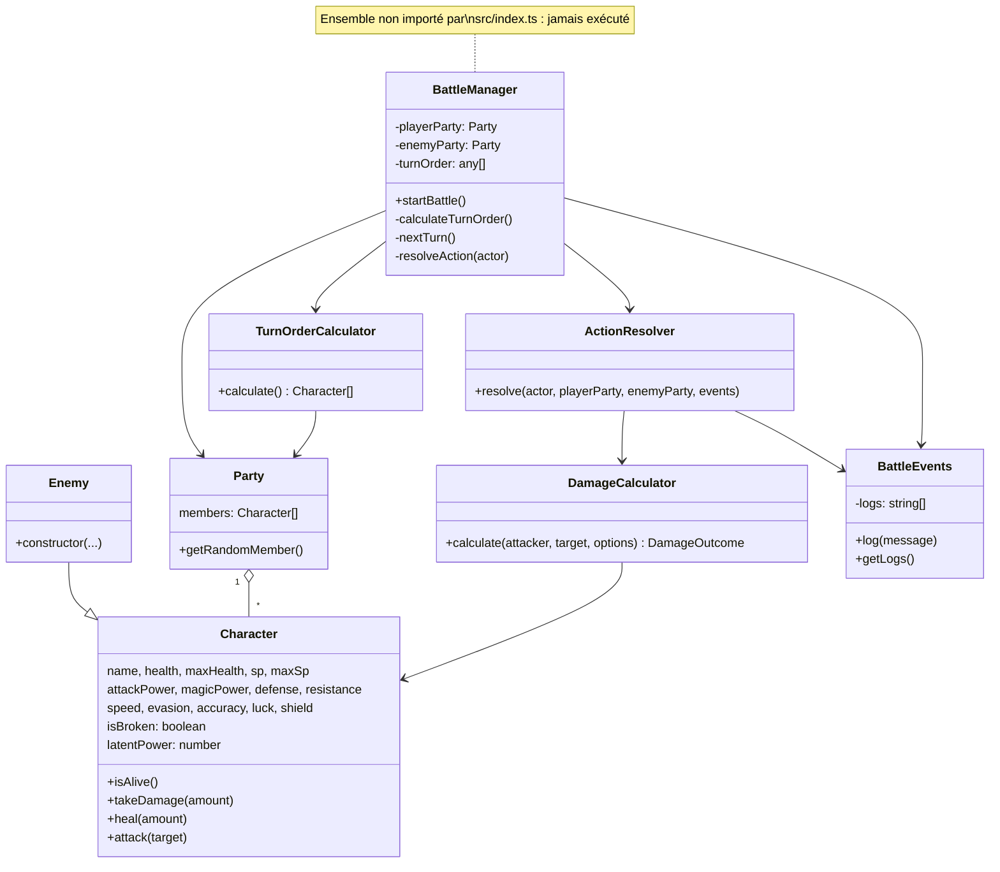
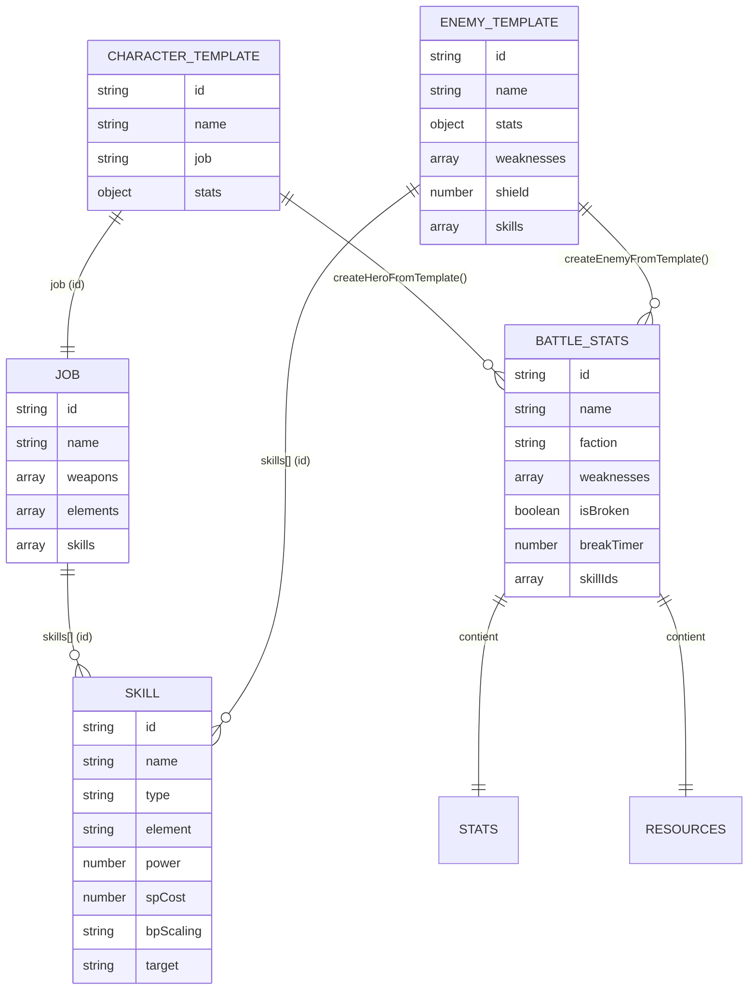

# Diagrammes — Octorogue Traveler

*Diagrammes complémentaires à `architecture.md`, centrés sur le fonctionnement interne (navigation, moteur de combat, relations de classes, structure des données).*

## Architecture générale

## Navigation entre scènes

## Moteur de combat — cycle d'un tour

## Relations entre les principales classes (module actif)

## Relations entre les principales classes (module orphelin, non exécuté)

## Structure des données (JSON → modèles)

